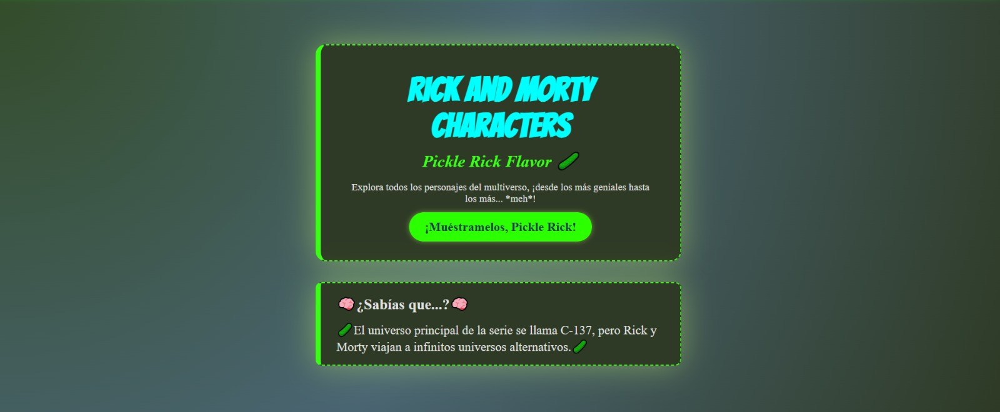
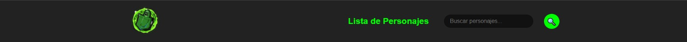
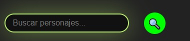
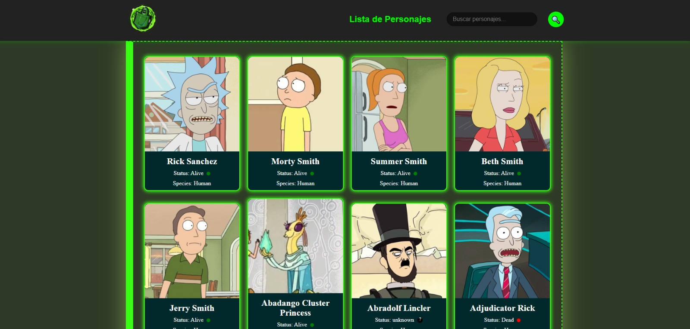
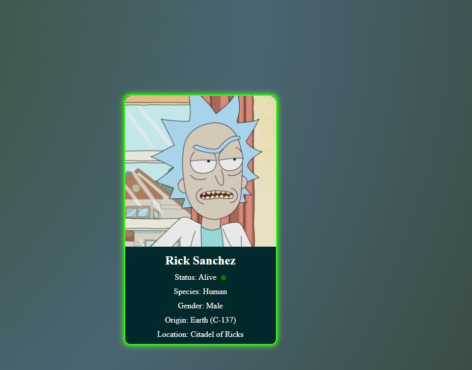

# rick&morty

## Descripción

Esta es una aplicación web construida con React que te permite buscar y explorar los personajes de la popular serie de televisión Rick and Morty. Puedes buscar personajes específicos y ver detalles como su estado, especie, género, origen, ubicación actual y la lista de episodios en los que han aparecido.

## Tecnologías Utilizadas

* **React:** Biblioteca de JavaScript para construir interfaces de usuario dinámicas.
* **HTML:** Lenguaje de marcado estándar para la estructura de la página web.
* **CSS:** Lenguaje de diseño para la presentación visual de la página web.

## Características Principales

* **Búsqueda de Personajes:** Encuentra fácilmente tus personajes favoritos de Rick and Morty utilizando la barra de búsqueda.
* **Visualización de Datos:** Muestra información detallada de cada personaje, incluyendo:
    * Estado (Vivo, Muerto, Desconocido)
    * Especie
    * Género
    * Origen (planeta o dimensión)
    * Ubicación Actual (planeta o dimensión)
* **Interfaz Intuitiva:** Diseño limpio y fácil de usar para una experiencia de navegación agradable.

## Instalación

Para ejecutar este proyecto localmente, sigue estos pasos:

1.  **Clona el repositorio:**
    ```bash
    git clone <https://github.com/GustavoBOG/Rick-morty.git>
    ```

2.  **Navega al directorio del proyecto:**
    ```bash
    cd rick&morty
    ```

3.  **Instala las dependencias:**
    ```bash
    npm install
    # o
    yarn install
    ```

## Uso

Una vez que las dependencias estén instaladas, puedes iniciar la aplicación de desarrollo con el siguiente comando:

```bash
npm run dev
```

**Esto abrirá la aplicación en tu navegador web (normalmente en `http://localhost:3000`).**

**Simplemente utiliza la barra de búsqueda para ingresar el nombre de un personaje o simplemente ve a la lista de personajes y ve pasando las paginas. Los resultados se mostrarán dinámicamente. Haz clic en un personaje para ver sus detalles completos.**

## Capturas de Pantalla
* **pagina de home** 

* **Barra de navegacion** 

* **Buscador** 

* **lista de personajes** 

* **paginacion** 

* **carta individual del personaje** 


## Contribuciones

Las contribuciones son bienvenidas. Si deseas mejorar este proyecto, siéntete libre de crear un "pull request" con tus cambios. Por favor, asegúrate de seguir las buenas prácticas de codificación y documentar tus cambios.

## Agradecimientos

Agradezco a la API de https://rickandmortyapi.com por proporcionar los datos de los personajes.

---

¡Gracias por la observación! A veces se me escapan los detalles. ¿Listo para el siguiente proyecto?
